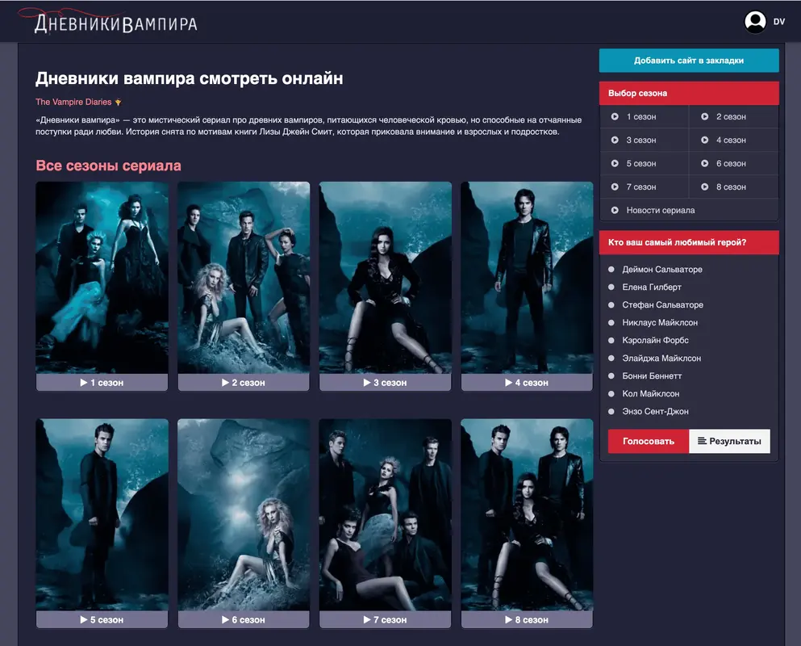

<p align="center">
  
</p>

<h1 align="center">Дневники вампира</h1>

<p align="center">
  Удобное приложение для сайта по сериалу «Дневники вампира».
</p>

<p align="center">
  
</p>

## Скачать

| Платформа | Скачать |
|----------|---------|
| Android | [vampire-android-1.0.1.apk](https://github.com/maxmayersweb/vampirediaries/releases/download/v1.0/vampire-android-1.0.1.apk) |
| Web | [vampirediares.info](https://vampirediares.info/) |

Все версии и checksums доступны в [Releases](https://github.com/maxmayersweb/vampirediaries/releases).

## Возможности

- Windows-приложение с быстрым запуском и автообновлениями.
- APK для Android-смартфонов.
- Отдельная сборка для Android TV и управления с пульта.
- Веб-версия для быстрого входа без установки.
- Release notes и checksums для каждой версии.

## Android через Obtainium

Можно добавить приложение в [Obtainium](https://github.com/ImranR98/Obtainium), чтобы получать уведомления о новых APK.

URL репозитория:

```text
https://github.com/maxmayersweb/vampirediaries/
```


## FAQ

**Где скачать последнюю версию?**  
В разделе [Releases](https://github.com/maxmayersweb/vampirediaries/releases/).

**Есть версия для Android TV?**  
Да, используйте файл `vampire-android-*.apk`.

**Можно ли пользоваться без установки?**  
Да, откройте [веб-версию](https://vampirediares.info/).

## SEO

vampirediares.info — приложение для Windows, Android и Android TV: удобный клиент, APK-релизы, Android TV build, веб-версия, обновления через GitHub Releases.
